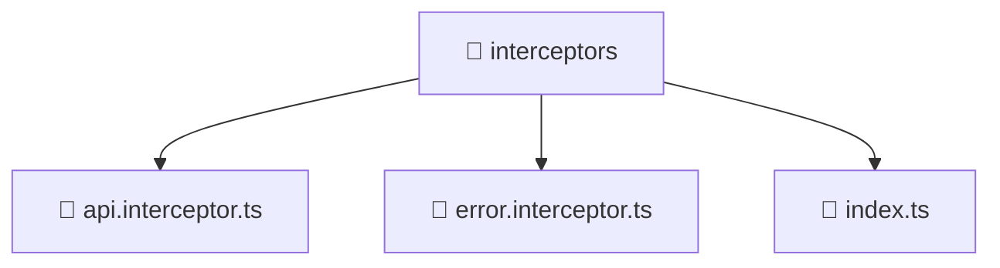

# 📁 interceptors

[Root](/.) > [frontend](/frontend) > [src](/frontend/src) > [core](/frontend/src/core) > [interceptors](/frontend/src/core/interceptors)

## 🎯 Purpose
Delivering luxury-tier architectural components and high-performance logic for the **Interceptors** domain. This directory is a crucial part of the Mavluda Beauty full-stack ecosystem, ensuring seamless scalability, robust performance, and an elite digital experience.

**Architecture Layer:** Core Logic (Feature Sliced Design / Layered Architecture)

## 🏗️ Architecture


## 📄 File Registry
| File Name | Type | Responsibility | Key Aliases Used |
|---|---|---|---|
| `api.interceptor.ts` | TypeScript | Core logic and utilities for this domain. | @angular, @shared |
| `error.interceptor.ts` | TypeScript | Core logic and utilities for this domain. | @angular, @shared |
| `index.ts` | TypeScript | Core logic and utilities for this domain. | N/A |

## 🔗 Dependencies
- `@angular/common/http`
- `@angular/core`
- `@shared/lib`
- `@shared/services`
- `rxjs`

## 🛠️ Usage
```markdown
```markdown
> This directory acts primarily as a structural container or logic module.
> To interact with its contents, import the relevant exported members from the `index.ts` or specifically targeted files.
```
```
