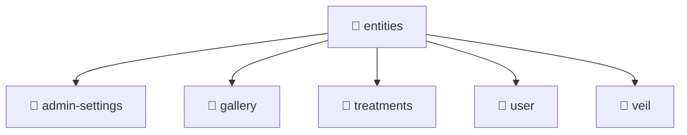

# 📁 entities

[Root](/.) > [frontend](/frontend) > [src](/frontend/src) > [entities](/frontend/src/entities)

**FSD Layer:** Entity

## 🎯 Purpose
Data models, type definitions, schemas, and Data Transfer Objects (DTOs) for structural typing.

## 🏗️ Architecture


## 📄 File Registry
| File Name | Type | Responsibility | Key Aliases Used |
|---|---|---|---|

## 🔗 Dependencies
- No external dependencies.

## 🛠️ Usage
```typescript
import { SpecificModel } from './models';
let data: SpecificModel;
```
