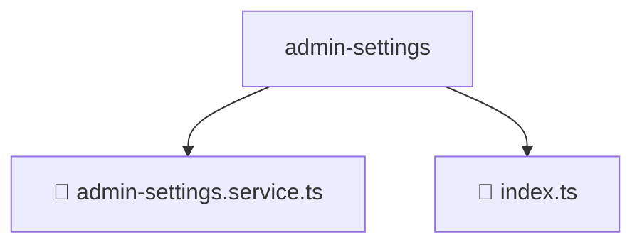

# 📂 ADMIN-SETTINGS

> 💎 **Mavluda Beauty - Luxury Professional Architecture**

### 📍 Breadcrumb Navigation
`. > frontend > src > entities > admin-settings`

## 🎯 PURPOSE
This directory encapsulates `Entities` level functionality within the Mavluda Beauty ecosystem, ensuring proper separation of concerns and architectural transparency.

**FSD / Architecture Layer:** `Entities`

## 🏗️ ARCHITECTURE


## 📄 FILE REGISTRY

| Item Name | Type | Responsibility | Key Aliases Used |
|-----------|------|----------------|------------------|
| `📄 admin-settings.service.ts` | `.ts` | Service logic | `@core/constants/api-endpoints, @angular/core, @shared/models/admin-settings.model, @angular/common/http` |
| `📄 index.ts` | `.ts` | General functionality | `None` |

## 🔗 DEPENDENCIES
- `@core/constants/api-endpoints`
- `@angular/core`
- `@shared/models/admin-settings.model`
- `@angular/common/http`

## 🛠️ USAGE
```typescript
// Example usage context
import { ... } from './admin-settings.service';

// Integrate admin-settings.service logic into your feature.
```
