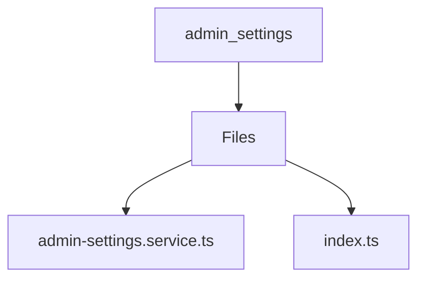

# 🏷️ Admin Settings Directory

> *Elegance, Precision, and Luxury Professionalism — The Mavluda Beauty Standard.*

## 🧭 Breadcrumb Navigation
[frontend](/frontend) ➔ [src](/frontend/src) ➔ [entities](/frontend/src/entities) ➔ [admin-settings](/frontend/src/entities/admin-settings)

## 🎯 Purpose
This directory encapsulates the essential architecture and logic for the **Admin Settings** domain within the Mavluda Beauty ecosystem. It serves as a foundational component ensuring robust, scalable, and elegant operations.

**Feature Sliced Design (FSD) Layer:** `Entity`

## 🏗️ Architecture


## 📄 File Registry
| File Name | Type | Responsibility | Key Aliases Used |
|---|---|---|---|
| `admin-settings.service.ts` | TypeScript | Exports: AdminSettingsService | @shared |
| `index.ts` | TypeScript | Defines logic and structure for index.ts. | None |

## 🔗 Dependencies
- `@angular/common/http`
- `@angular/core`
- `@core/constants/api-endpoints`
- `@shared/models/admin-settings.model`
- `rxjs`

## 🛠️ Usage
```typescript
// To utilize the luxurious capabilities of this module:
import { AdminSettingsService } from './path/to/adminsettingsservice';

// Ensure properly typed interactions per Mavluda Beauty standards
```
