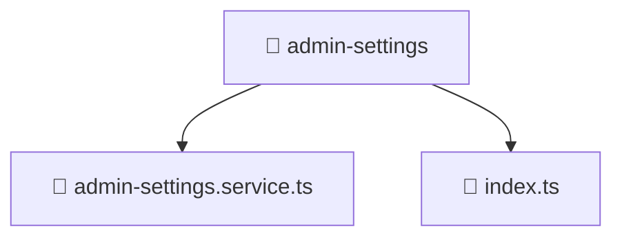

### 🧭 Breadcrumbs
[Root](/) > [frontend](/frontend) > [src](/frontend/src) > [entities](/frontend/src/entities) > [admin-settings](/frontend/src/entities/admin-settings)

# 📁 Admin-settings Directory
**Architecture Layer:** Entity Layer

## 🎯 Purpose
Provides luxury professional architectural implementation for the admin-settings module within the Mavluda Beauty ecosystem. Ensure robust functionality and elegant integration with the broader architecture.

## 🏗️ ARCHITECTURE


## 📄 FILE REGISTRY
| File Name | Type | Responsibility | Key Aliases Used |
|---|---|---|---|
| `admin-settings.service.ts` | TypeScript | Encapsulates business logic and data access for admin-settings.service.ts. | @angular/core, @core/constants/api-endpoints, @shared/models/admin-settings.model, @angular/common/http |
| `index.ts` | TypeScript | Provides core logic and orchestration for index.ts. | N/A |

## 🔗 DEPENDENCIES
- `@angular/common/http`
- `@angular/core`
- `@core/constants/api-endpoints`
- `@shared/models/admin-settings.model`

## 🛠️ USAGE
```typescript
// Example architectural integration for admin-settings
// Utilize the exported members according to Mavluda Beauty's standard conventions.
```

---
*Maintained by Mavluda Beauty - Architecture & Engineering*

---
*Maintained by Mavluda Beauty - Architecture & Engineering*