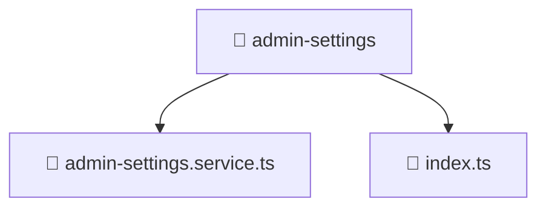

# 📁 Admin-settings

[Root](/.) > [frontend](/frontend) > [src](/frontend/src) > [entities](/frontend/src/entities) > [admin-settings](/frontend/src/entities/admin-settings)

**FSD Layer:** Entities 📦

## 🎯 Purpose
Delivering luxury-tier architectural components and high-performance logic for the **admin-settings** domain. This directory is a crucial part of the Mavluda Beauty full-stack ecosystem, ensuring seamless scalability, robust performance, and an elite digital experience.

## 🏗️ Architecture


## 📄 File Registry
| File Name | Type | Responsibility | Key Aliases Used |
|---|---|---|---|
| `admin-settings.service.ts` | TypeScript/JavaScript | Encapsulates business logic and data access for admin-settings.service.ts. | @angular, @core, @shared |
| `index.ts` | TypeScript/JavaScript | Provides core logic and orchestration for index.ts. | N/A |

## 🔗 Dependencies
- `@angular/common/http`
- `@angular/core`
- `@core/constants/api-endpoints`
- `@shared/models/admin-settings.model`
- `rxjs`

## 🛠️ Usage
```typescript
// Example usage within the Mavluda Beauty ecosystem
import { relevantMember } from './admin-settings';

// Integrate into the application architecture
relevantMember.execute();
```
