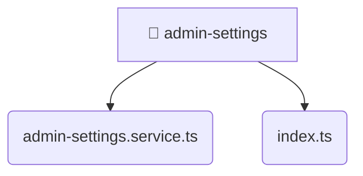

# [root](/) / [frontend](/frontend) / [src](/frontend/src) / [entities](/frontend/src/entities) / [admin-settings](/frontend/src/entities/admin-settings)

## 🏷️ 📁 Admin-settings

### 🎯 PURPOSE
The `admin-settings` directory forms a critical foundation within the Mavluda Beauty ecosystem, meticulously orchestrating the admin-settings logic to ensure a seamless and premium experience.

This directory resides within the **Entities** layer of our Feature Sliced Design (FSD) architecture, strictly adhering to Mavluda Beauty's robust separation of concerns.

### 🏗️ ARCHITECTURE


### 📄 FILE REGISTRY
| File Name | Type | Responsibility | Key Aliases Used |
|---|---|---|---|
| `admin-settings.service.ts` | `ts` | Business logic and service layer. | @angular, @core, @shared |
| `index.ts` | `ts` | Core logic implementation. | None |

### 🔗 DEPENDENCIES
- `./admin-settings.service`
- `@angular/common/http`
- `@angular/core`
- `@core/constants/api-endpoints`
- `@shared/models/admin-settings.model`
- `rxjs`

### 🛠️ USAGE
```typescript
// Seamlessly integrate admin-settings into your refined workflows:
import { /* exported members */ } from '@path/to/admin-settings';
```
