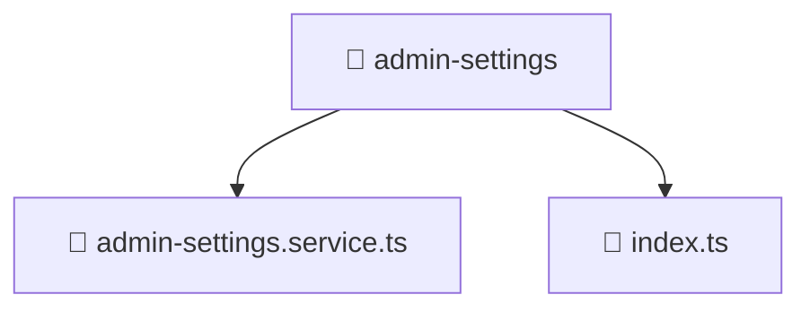

# 📁 admin-settings

[Root](/../../../../README.md) / [frontend](../../../README.md) / [src](../../README.md) / [entities](../README.md) / [admin-settings](./README.md)

## 🎯 Purpose
Delivering luxury-tier architectural components and high-performance logic for the **admin-settings** domain. This directory is a crucial part of the Mavluda Beauty full-stack ecosystem, ensuring seamless scalability, robust performance, and an elite digital experience.

**FSD Layer:** Entities

## 🏗️ Architecture


## 📄 File Registry
| File Name | Type | Responsibility | Key Aliases Used |
|---|---|---|---|
| `admin-settings.service.ts` | Service | Encapsulates business logic and data access for admin-settings.service.ts. | @angular, @core, @shared |
| `index.ts` | TypeScript | Provides core logic and orchestration for index.ts. | N/A |


## 🔗 Dependencies
**Internal / Aliases:**
- `@angular/common/http`
- `@angular/core`
- `@core/constants/api-endpoints`
- `@shared/models/admin-settings.model`

**External:**
- `rxjs`


## 🛠️ Usage
```typescript
// Example usage within the Mavluda Beauty ecosystem
import { relevantMember } from './admin-settings.service';

// Integrate into the application architecture
relevantMember.execute();
```
