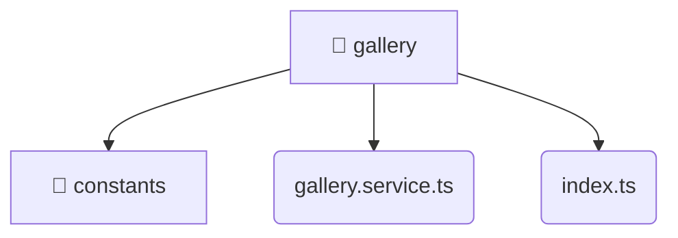

# [root](/) / [frontend](/frontend) / [src](/frontend/src) / [entities](/frontend/src/entities) / [gallery](/frontend/src/entities/gallery)

## 🏷️ 📁 Gallery (Entity Layer)

### 🎯 PURPOSE
The `gallery` entity defines the data models and core business logic for the gallery domain within the frontend.

### 🏗️ ARCHITECTURE


### 📄 FILE REGISTRY
| File Name | Type | Responsibility | Key Aliases Used |
|---|---|---|---|
| `gallery.service.ts` | `ts` | Business logic and service layer. | @angular, @shared |
| `index.ts` | `ts` | Core logic implementation. | None |

### 🔗 DEPENDENCIES
- `./constants/gallery.constants`
- `./gallery.service`
- `@angular/common/http`
- `@angular/core`
- `@shared/models`
- `rxjs`

### 🛠️ USAGE
```typescript
// Seamlessly integrate gallery into your refined workflows:
import { /* exported members */ } from '@path/to/gallery';
```
