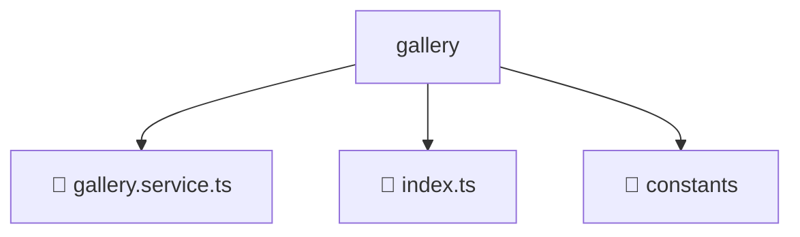

# 📂 GALLERY

> 💎 **Mavluda Beauty - Luxury Professional Architecture**

### 📍 Breadcrumb Navigation
`. > frontend > src > entities > gallery`

## 🎯 PURPOSE
This directory encapsulates `Entities` level functionality within the Mavluda Beauty ecosystem, ensuring proper separation of concerns and architectural transparency.

**FSD / Architecture Layer:** `Entities`

## 🏗️ ARCHITECTURE


## 📄 FILE REGISTRY

| Item Name | Type | Responsibility | Key Aliases Used |
|-----------|------|----------------|------------------|
| `📄 gallery.service.ts` | `.ts` | Service logic | `@angular/core, @shared/models, @angular/common/http` |
| `📄 index.ts` | `.ts` | General functionality | `None` |
| `📁 constants` | `Directory` | Subdirectory logic grouping | `None` |

## 🔗 DEPENDENCIES
- `@angular/core`
- `@shared/models`
- `@angular/common/http`

## 🛠️ USAGE
```typescript
// Example usage context
import { ... } from './gallery.service';

// Integrate gallery.service logic into your feature.
```
