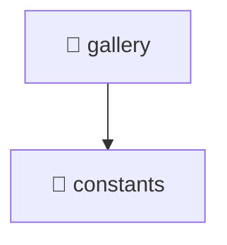

# 📁 gallery

[Root](/.) > [frontend](/frontend) > [src](/frontend/src) > [entities](/frontend/src/entities) > [gallery](/frontend/src/entities/gallery)

## 🎯 Purpose
Delivering luxury-tier architectural components and high-performance logic for the **gallery** domain. This directory is a crucial part of the Mavluda Beauty full-stack ecosystem, ensuring seamless scalability, robust performance, and an elite digital experience.
> **FSD Layer:** Entities - Adhering to strict Feature Sliced Design architectural constraints.

## 🏗️ Architecture


## 📄 File Registry
| File Name | Type | Responsibility | Key Aliases Used |
|---|---|---|---|
| `gallery.service.ts` | Service | Business logic and state management. | @angular, @shared |
| `index.ts` | File | Core logic and utilities for this domain. | N/A |


## 🔗 Dependencies
- `@angular/core`
- `@angular/common/http`
- `rxjs`
- `@shared/models`
- `./gallery.service`
- `./constants/gallery.constants`

## 🛠️ Usage
```typescript
// Example usage within the Mavluda Beauty ecosystem
import { relevantMember } from './gallery.service';

// Integrate into the application architecture
relevantMember.execute();
```
