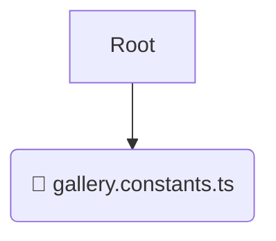

# 📂 constants

*Breadcrumbs:* [frontend](/frontend) / [src](/frontend/src) / [entities](/frontend/src/entities) / [gallery](/frontend/src/entities/gallery) / [constants](/frontend/src/entities/gallery/constants)

## 🎯 PURPOSE
This directory `constants` is an integral part of the Mavluda Beauty ecosystem. (FSD Layer: Entities) It contains business entities and core UI models.
This directory is meticulously maintained to uphold the 'Luxury Professional' standards of the Mavluda Beauty brand.

## 🏗️ ARCHITECTURE


## 📄 FILE REGISTRY
| File Name | Type | Responsibility | Key Aliases Used |
|---|---|---|---|
| `gallery.constants.ts` | `ts` | Core functionality | `None` |

## 🔗 DEPENDENCIES
- No significant internal/external dependencies found.

## 🛠️ USAGE
```typescript
// Example placeholder for interacting with the constants module
import { example } from './gallery.constants.ts';
```
