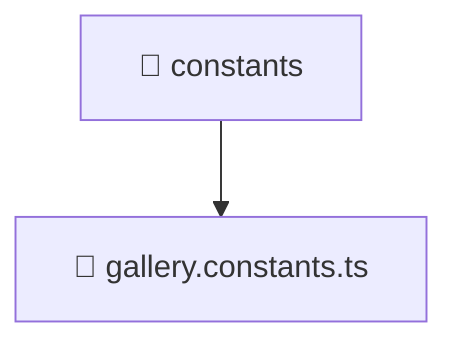

# 📁 constants

[Root](/.) > [frontend](/frontend) > [src](/frontend/src) > [entities](/frontend/src/entities) > [gallery](/frontend/src/entities/gallery) > [constants](/frontend/src/entities/gallery/constants)

**FSD Layer:** Entity

## 🎯 Purpose
Data models, type definitions, schemas, and Data Transfer Objects (DTOs) for structural typing.

## 🏗️ Architecture


## 📄 File Registry
| File Name | Type | Responsibility | Key Aliases Used |
|---|---|---|---|
| `gallery.constants.ts` | TypeScript | Provides core logic and orchestration for gallery.constants.ts. | N/A |

## 🔗 Dependencies
- No external dependencies.

## 🛠️ Usage
```typescript
import { SpecificModel } from './models';
let data: SpecificModel;
```
