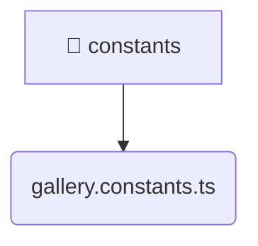

# [root](/) / [frontend](/frontend) / [src](/frontend/src) / [entities](/frontend/src/entities) / [gallery](/frontend/src/entities/gallery) / [constants](/frontend/src/entities/gallery/constants)

## 🏷️ 📁 Constants

### 🎯 PURPOSE
The `constants` directory forms a critical foundation within the Mavluda Beauty ecosystem, meticulously orchestrating the constants logic to ensure a seamless and premium experience.

This directory resides within the **Entities** layer of our Feature Sliced Design (FSD) architecture, strictly adhering to Mavluda Beauty's robust separation of concerns.

### 🏗️ ARCHITECTURE


### 📄 FILE REGISTRY
| File Name | Type | Responsibility | Key Aliases Used |
|---|---|---|---|
| `gallery.constants.ts` | `ts` | Core logic implementation. | None |

### 🔗 DEPENDENCIES
- *Self-contained premium module.*

### 🛠️ USAGE
```typescript
// Seamlessly integrate constants into your refined workflows:
import { /* exported members */ } from '@path/to/constants';
```
