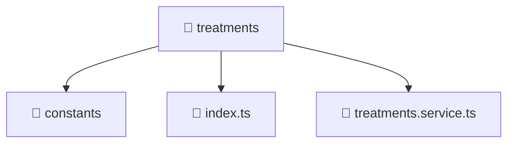

# 📁 treatments

[Root](/.) > [frontend](/frontend) > [src](/frontend/src) > [entities](/frontend/src/entities) > [treatments](/frontend/src/entities/treatments)

**FSD Layer:** Entity

## 🎯 Purpose
Data models, type definitions, schemas, and Data Transfer Objects (DTOs) for structural typing.

## 🏗️ Architecture


## 📄 File Registry
| File Name | Type | Responsibility | Key Aliases Used |
|---|---|---|---|
| `index.ts` | TypeScript | Provides core logic and orchestration for index.ts. | N/A |
| `treatments.service.ts` | TypeScript | Encapsulates business logic and data access for treatments.service.ts. | @angular, @core, @features, @shared |

## 🔗 Dependencies
- `@angular/common/http`
- `@angular/core`
- `@core/constants`
- `@features/treatments`
- `@shared/lib`
- `rxjs`

## 🛠️ Usage
```typescript
import { SpecificModel } from './models';
let data: SpecificModel;
```
