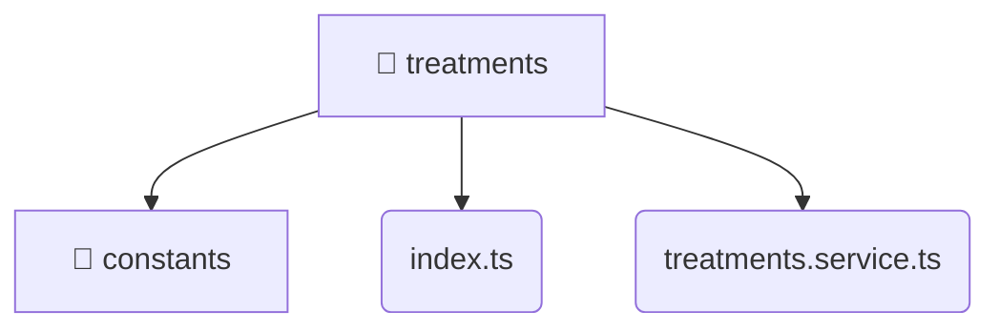

# [root](/) / [frontend](/frontend) / [src](/frontend/src) / [entities](/frontend/src/entities) / [treatments](/frontend/src/entities/treatments)

## 🏷️ 📁 Treatments

### 🎯 PURPOSE
The `treatments` directory forms a critical foundation within the Mavluda Beauty ecosystem, meticulously orchestrating the treatments logic to ensure a seamless and premium experience.

This directory resides within the **Entities** layer of our Feature Sliced Design (FSD) architecture, strictly adhering to Mavluda Beauty's robust separation of concerns.

### 🏗️ ARCHITECTURE


### 📄 FILE REGISTRY
| File Name | Type | Responsibility | Key Aliases Used |
|---|---|---|---|
| `index.ts` | `ts` | Core logic implementation. | None |
| `treatments.service.ts` | `ts` | Business logic and service layer. | @angular, @features, @shared, @core |

### 🔗 DEPENDENCIES
- `./constants/treatments.constants`
- `./treatments.service`
- `@angular/common/http`
- `@angular/core`
- `@core/constants`
- `@features/treatments`
- `@shared/lib`
- `rxjs`

### 🛠️ USAGE
```typescript
// Seamlessly integrate treatments into your refined workflows:
import { /* exported members */ } from '@path/to/treatments';
```
