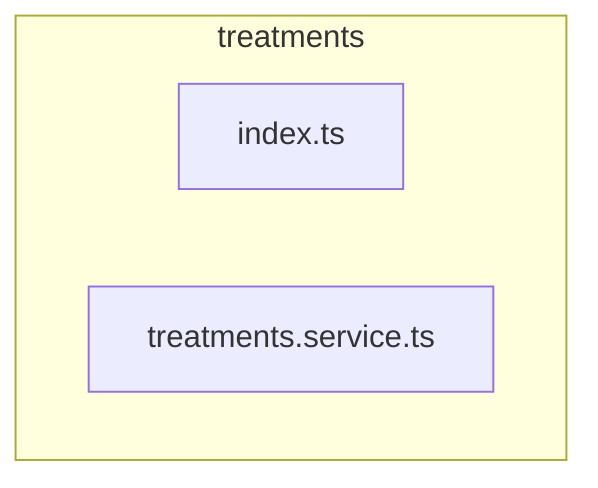

# 💆‍♀️ treatments

[frontend](../../../README.md) > [src](../../README.md) > [entities](../README.md) > [treatments](README.md)

---

### 🎯 PURPOSE
Elevating the digital experience for the Mavluda Beauty ecosystem, this module manages the sophisticated Entities Layer (Business entities and state) operations.

*FSD Layer:* **Entities Layer (Business entities and state)**

---

### 🏗️ ARCHITECTURE



---

### 📄 FILE REGISTRY
| File Name | Type | Responsibility | Key Aliases Used |
|-----------|------|----------------|------------------|
| `index.ts` | Source | Handles source logic for Mavluda Beauty's luxury standards. | `None` |
| `treatments.service.ts` | Service | Handles service logic for Mavluda Beauty's luxury standards. | `@shared, @core, @features, @angular` |

---

### 🔗 DEPENDENCIES
**Key Path Aliases Detected:** `@shared`, `@core`, `@features`, `@angular`

Notable imports:
- `@angular/common/http`
- `rxjs`
- `@angular/core`
- `./treatments.service`
- `@features/treatments`
- `./constants/treatments.constants`
- `@shared/lib`
- `@core/constants`

---

### 🛠️ USAGE
To interact with this directory's luxurious logic, integrate its exported components or services directly into your feature modules. Ensure strict adherence to the Entities Layer (Business entities and state) boundaries.

```typescript
// Example integration snippet
import { FeatureModule } from '@path/to/treatments';
```
