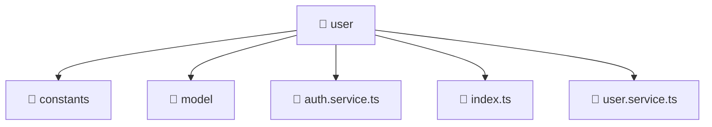

# 📁 Mavluda Beauty user

[frontend](/frontend) / [src](/frontend/src) / [entities](/frontend/src/entities) / [user](/frontend/src/entities/user)

## 🎯 Purpose
Delivering luxury-tier architectural components and high-performance logic for the **user** domain. This directory is a crucial part of the Mavluda Beauty full-stack ecosystem, ensuring seamless scalability, robust performance, and an elite digital experience.

> **FSD Layer**: `Entities` - Adhering to Feature Sliced Design principles.

## 🏗️ Architecture


## 📄 File Registry
| File Name | Type | Responsibility | Key Aliases Used |
|---|---|---|---|
| `auth.service.ts` | Service | Encapsulates business logic and API calls. | `@angular/core, @angular/common/http, @angular/router` |
| `index.ts` | TypeScript Logic | Core logic and utilities for this domain. | N/A |
| `user.service.ts` | Service | Encapsulates business logic and API calls. | `@angular/core, @angular/common/http` |


## 🔗 Dependencies
**Path Aliases:**
- `@angular/core`
- `@angular/common/http`
- `@angular/router`

**External Packages:**
- `rxjs/operators`
- `jwt-decode`
- `rxjs`


## 🛠️ Usage
```typescript
// Example integration for user
// Import capabilities from this directory to enrich your modules.
```
> This directory provides specialized logic tailored to the Mavluda Beauty standard.
