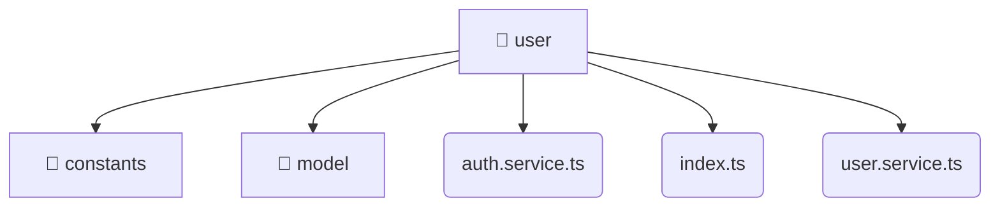

# [root](/) / [frontend](/frontend) / [src](/frontend/src) / [entities](/frontend/src/entities) / [user](/frontend/src/entities/user)

## 🏷️ 📁 User

### 🎯 PURPOSE
The `user` directory forms a critical foundation within the Mavluda Beauty ecosystem, meticulously orchestrating the user logic to ensure a seamless and premium experience.

This directory resides within the **Entities** layer of our Feature Sliced Design (FSD) architecture, strictly adhering to Mavluda Beauty's robust separation of concerns.

### 🏗️ ARCHITECTURE


### 📄 FILE REGISTRY
| File Name | Type | Responsibility | Key Aliases Used |
|---|---|---|---|
| `auth.service.ts` | `ts` | Business logic and service layer. | @angular |
| `index.ts` | `ts` | Core logic implementation. | None |
| `user.service.ts` | `ts` | Business logic and service layer. | @angular |

### 🔗 DEPENDENCIES
- `./auth.service`
- `./model/user.model`
- `./user.service`
- `@angular/common/http`
- `@angular/core`
- `@angular/router`
- `jwt-decode`
- `rxjs`
- `rxjs/operators`

### 🛠️ USAGE
```typescript
// Seamlessly integrate user into your refined workflows:
import { /* exported members */ } from '@path/to/user';
```
