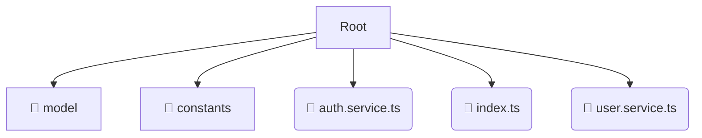

# 📂 user

*Breadcrumbs:* [frontend](/frontend) / [src](/frontend/src) / [entities](/frontend/src/entities) / [user](/frontend/src/entities/user)

## 🎯 PURPOSE
This directory `user` is an integral part of the Mavluda Beauty ecosystem. (FSD Layer: Entities) It contains business entities and core UI models.
This directory is meticulously maintained to uphold the 'Luxury Professional' standards of the Mavluda Beauty brand.

## 🏗️ ARCHITECTURE


## 📄 FILE REGISTRY
| File Name | Type | Responsibility | Key Aliases Used |
|---|---|---|---|
| `auth.service.ts` | `ts` | Core functionality | `@angular/router, @angular/core, @angular/common/http` |
| `index.ts` | `ts` | Core functionality | `None` |
| `user.service.ts` | `ts` | Core functionality | `@angular/core, @angular/common/http` |

## 🔗 DEPENDENCIES
- `@angular/router`
- `@angular/core`
- `@angular/common/http`

## 🛠️ USAGE
```typescript
// Example placeholder for interacting with the user module
import { example } from './auth.service.ts';
```
