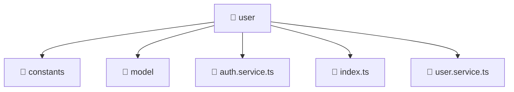

# 📁 user

[Root](/../../../../README.md) / [frontend](../../../README.md) / [src](../../README.md) / [entities](../README.md) / [user](./README.md)

## 🎯 Purpose
Delivering luxury-tier architectural components and high-performance logic for the **user** domain. This directory is a crucial part of the Mavluda Beauty full-stack ecosystem, ensuring seamless scalability, robust performance, and an elite digital experience.

**FSD Layer:** Entities

## 🏗️ Architecture


## 📄 File Registry
| File Name | Type | Responsibility | Key Aliases Used |
|---|---|---|---|
| `auth.service.ts` | Service | Encapsulates business logic and data access for auth.service.ts. | @angular |
| `index.ts` | TypeScript | Provides core logic and orchestration for index.ts. | N/A |
| `user.service.ts` | Service | Encapsulates business logic and data access for user.service.ts. | @angular |


## 🔗 Dependencies
**Internal / Aliases:**
- `./model/user.model`
- `@angular/common/http`
- `@angular/core`
- `@angular/router`

**External:**
- `jwt-decode`
- `rxjs`
- `rxjs/operators`


## 🛠️ Usage
```typescript
// Example usage within the Mavluda Beauty ecosystem
import { relevantMember } from './auth.service';

// Integrate into the application architecture
relevantMember.execute();
```
