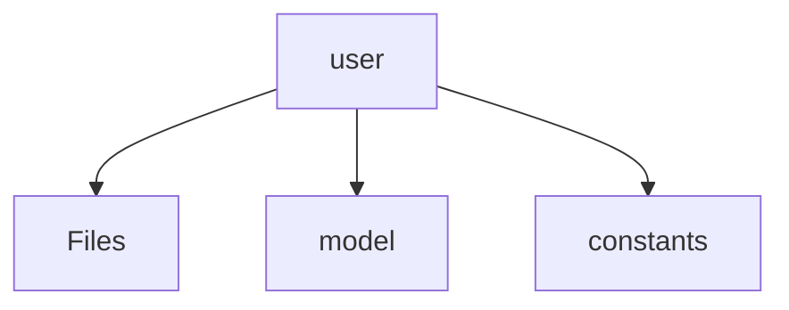

# 📁 User Directory

[frontend](/frontend) > [src](/frontend/src) > [entities](/frontend/src/entities) > [user](/frontend/src/entities/user)

## 🎯 Purpose
A high-level module handling `user` logic within the Mavluda Beauty ecosystem. This directory adheres to our "Luxury Professional" architectural standards.

**FSD Layer:** Entities


## 🏗️ Architecture



## 📄 File Registry
| File Name | Type | Responsibility | Key Aliases Used |
|-----------|------|----------------|------------------|
| `auth.service.ts` | Service | Executes core business logic and use cases. | @angular/common/http, @angular/core, @angular/router |
| `index.ts` | TypeScript | Provides localized typescript definitions. | None |
| `user.service.ts` | Service | Executes core business logic and use cases. | @angular/common/http, @angular/core |

## 🔗 Dependencies
- `@angular/common/http`
- `@angular/core`
- `@angular/router`

## 🛠️ Usage
```typescript
// Architectural overview snippet
import { InternalLogic } from './internal-file';
// Ensure adherence to Hexagonal / FSD principles
```
