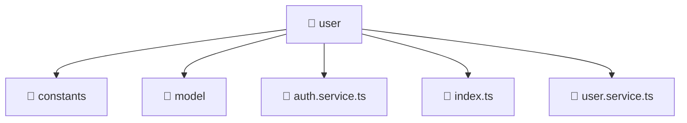

# 📁 user

[Root](/.) > [frontend](/frontend) > [src](/frontend/src) > [entities](/frontend/src/entities) > [user](/frontend/src/entities/user)

**FSD Layer:** Entity

## 🎯 Purpose
Data models, type definitions, schemas, and Data Transfer Objects (DTOs) for structural typing.

## 🏗️ Architecture


## 📄 File Registry
| File Name | Type | Responsibility | Key Aliases Used |
|---|---|---|---|
| `auth.service.ts` | TypeScript | Encapsulates business logic and data access for auth.service.ts. | @angular |
| `index.ts` | TypeScript | Provides core logic and orchestration for index.ts. | N/A |
| `user.service.ts` | TypeScript | Encapsulates business logic and data access for user.service.ts. | @angular |

## 🔗 Dependencies
- `./model/user.model`
- `@angular/common/http`
- `@angular/core`
- `@angular/router`
- `jwt-decode`
- `rxjs`
- `rxjs/operators`

## 🛠️ Usage
```typescript
import { SpecificModel } from './models';
let data: SpecificModel;
```
