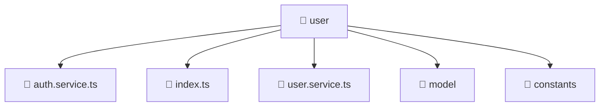

### 🧭 Breadcrumbs
[Root](/) > [frontend](/frontend) > [src](/frontend/src) > [entities](/frontend/src/entities) > [user](/frontend/src/entities/user)

# 📁 User Directory
**Architecture Layer:** Entity Layer

## 🎯 Purpose
Provides luxury professional architectural implementation for the user module within the Mavluda Beauty ecosystem. Ensure robust functionality and elegant integration with the broader architecture.

## 🏗️ ARCHITECTURE


## 📄 FILE REGISTRY
| File Name | Type | Responsibility | Key Aliases Used |
|---|---|---|---|
| `auth.service.ts` | TypeScript | Encapsulates business logic and data access for auth.service.ts. | @angular/core, @angular/router, @angular/common/http |
| `index.ts` | TypeScript | Provides core logic and orchestration for index.ts. | N/A |
| `user.service.ts` | TypeScript | Encapsulates business logic and data access for user.service.ts. | @angular/core, @angular/common/http |

## 🔗 DEPENDENCIES
- `@angular/common/http`
- `@angular/core`
- `@angular/router`

## 🛠️ USAGE
```typescript
// Example architectural integration for user
// Utilize the exported members according to Mavluda Beauty's standard conventions.
```

---
*Maintained by Mavluda Beauty - Architecture & Engineering*

---
*Maintained by Mavluda Beauty - Architecture & Engineering*