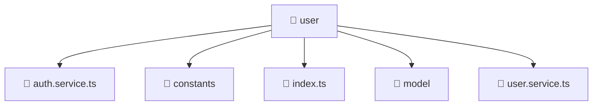

# 📁 user

[Root](/.) > [frontend](/frontend) > [src](/frontend/src) > [entities](/frontend/src/entities) > [user](/frontend/src/entities/user)

## 🎯 Purpose
Delivering luxury-tier architectural components and high-performance logic for the **user** domain. This directory is a crucial part of the Mavluda Beauty full-stack ecosystem, ensuring seamless scalability, robust performance, and an elite digital experience.

## 🏗️ Architecture


## 📄 File Registry
| File Name | Type | Responsibility | Key Aliases Used |
|---|---|---|---|
| `auth.service.ts` | TypeScript | Encapsulates business logic for auth | @angular/common/http, @angular/core, @angular/router |
| `index.ts` | TypeScript | Handles logic and definitions for index.ts | None |
| `user.service.ts` | TypeScript | Encapsulates business logic for user | @angular/common/http, @angular/core |

## 🔗 Dependencies
- `./model/user.model`
- `@angular/common/http`
- `@angular/core`
- `@angular/router`
- `jwt-decode`
- `rxjs`
- `rxjs/operators`

## 🛠️ Usage
```typescript
// Example usage within the Mavluda Beauty ecosystem
import { relevantMember } from './user';

// Integrate into the application architecture
relevantMember.execute();
```
