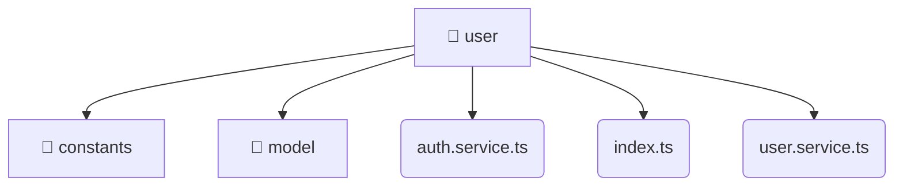

# [frontend](/frontend) / [src](/frontend/src) / [entities](/frontend/src/entities) / [user](/frontend/src/entities/user)

## 🏷️ 📁 User

### 🎯 PURPOSE
The `user` directory forms a critical foundation within the Mavluda Beauty ecosystem, meticulously orchestrating the user logic to ensure a seamless and premium experience. Integrated within our cutting-edge Angular frontend architecture, it crafts an elegant, highly-responsive user interface reflecting our luxury brand standards. This module is a distinguished component of the **Entities** layer under the Feature Sliced Design (FSD) methodology.

### 🏗️ ARCHITECTURE


### 📄 FILE REGISTRY
| File Name | Type | Responsibility | Key Aliases Used |
|---|---|---|---|
| `auth.service.ts` | `ts` | Encapsulates premium logic and definitions for `auth.service.ts`. | @angular/core, @angular/router, @angular/common/http |
| `index.ts` | `ts` | Encapsulates premium logic and definitions for `index.ts`. | None |
| `user.service.ts` | `ts` | Encapsulates premium logic and definitions for `user.service.ts`. | @angular/core, @angular/common/http |


### 🔗 DEPENDENCIES
- `@angular/common/http`
- `@angular/core`
- `@angular/router`

### 🛠️ USAGE
```typescript
// Seamlessly integrate user into your refined workflows:
import { /* exported members */ } from '@path/to/user';
```
