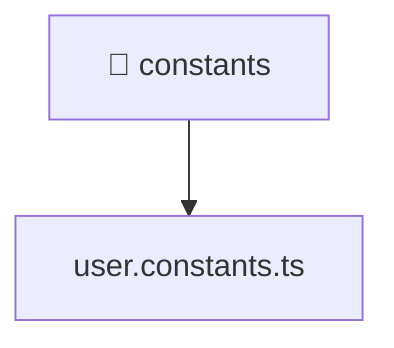

[🏠 Home](../../../../../README.md) > [frontend](../../../../README.md) > [src](../../../README.md) > [entities](../../README.md) > [user](../README.md) > [constants](./README.md)

# 📁 constants

**FSD Layer:** `Entities`

### 🎯 PURPOSE
Welcome to the exquisite **constants** module of the Mavluda Beauty ecosystem. This directory handles specific domain assets and logic. It is designed adhering to our 'Luxury Professional' standards.

### 🏗️ ARCHITECTURE


### 📄 FILE REGISTRY
| File Name | Type | Responsibility | Key Aliases Used |
|---|---|---|---|
| `user.constants.ts` | TypeScript File | Provides logic and definitions for user.constants.ts. | None |

### 🔗 DEPENDENCIES
No notable dependencies detected.

### 🛠️ USAGE
```typescript
// Example interaction or integration snippet
// Import members from constants based on module boundaries
```
