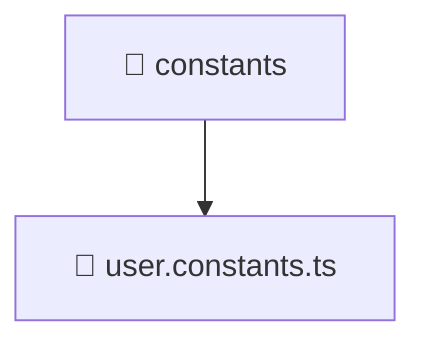

<!--
Mavluda Beauty - Luxury Professional Documentation
Generated for 100% Architectural Transparency
-->
[Home](../../../../../README.md) > [frontend](../../../../README.md) > [src](../../../README.md) > [entities](../../README.md) > [user](../README.md) > [constants](./README.md)

# 📁 CONSTANTS Directory

> **FSD Layer:** Entities

## 🎯 PURPOSE
Manages business entities, models, and core state related to specific domain objects.

## 🏗️ ARCHITECTURE


## 📄 FILE REGISTRY
| File Name | Type | Responsibility | Key Aliases Used |
|---|---|---|---|
| `user.constants.ts` | TypeScript | Core logic implementation. | - |


## 🔗 DEPENDENCIES
- No external or internal imports detected in this directory.

## 🛠️ USAGE
```typescript
// Example placeholder for interacting with constants
// Consult the individual files in the registry for specific APIs.
```
