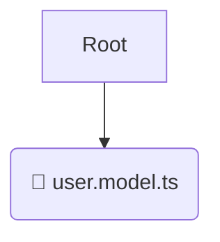

# 📂 model

*Breadcrumbs:* [frontend](/frontend) / [src](/frontend/src) / [entities](/frontend/src/entities) / [user](/frontend/src/entities/user) / [model](/frontend/src/entities/user/model)

## 🎯 PURPOSE
This directory `model` is an integral part of the Mavluda Beauty ecosystem. (FSD Layer: Entities) It contains business entities and core UI models.
This directory is meticulously maintained to uphold the 'Luxury Professional' standards of the Mavluda Beauty brand.

## 🏗️ ARCHITECTURE


## 📄 FILE REGISTRY
| File Name | Type | Responsibility | Key Aliases Used |
|---|---|---|---|
| `user.model.ts` | `ts` | Core functionality | `None` |

## 🔗 DEPENDENCIES
- No significant internal/external dependencies found.

## 🛠️ USAGE
```typescript
// Example placeholder for interacting with the model module
import { example } from './user.model.ts';
```
