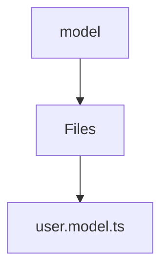

# 🏷️ Model Directory

> *Elegance, Precision, and Luxury Professionalism — The Mavluda Beauty Standard.*

## 🧭 Breadcrumb Navigation
[frontend](/frontend) ➔ [src](/frontend/src) ➔ [entities](/frontend/src/entities) ➔ [user](/frontend/src/entities/user) ➔ [model](/frontend/src/entities/user/model)

## 🎯 Purpose
This directory encapsulates the essential architecture and logic for the **Model** domain within the Mavluda Beauty ecosystem. It serves as a foundational component ensuring robust, scalable, and elegant operations.

**Feature Sliced Design (FSD) Layer:** `Entity`

## 🏗️ Architecture


## 📄 File Registry
| File Name | Type | Responsibility | Key Aliases Used |
|---|---|---|---|
| `user.model.ts` | TypeScript | Exports: User, AuthResponse | None |

## 🔗 Dependencies
No external or cross-module dependencies detected.

## 🛠️ Usage
```typescript
// To utilize the luxurious capabilities of this module:
import { User } from './path/to/user';

// Ensure properly typed interactions per Mavluda Beauty standards
```
