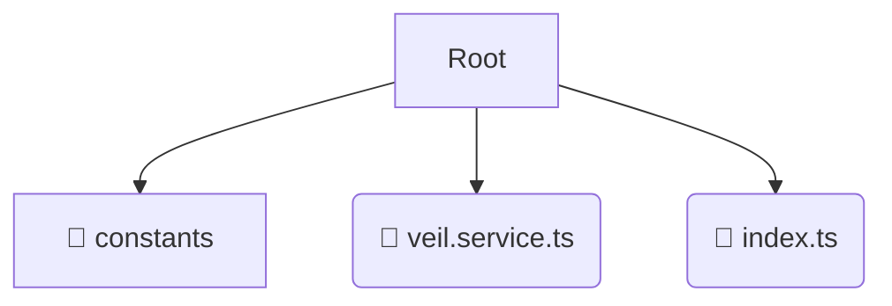

# 📂 veil

*Breadcrumbs:* [frontend](/frontend) / [src](/frontend/src) / [entities](/frontend/src/entities) / [veil](/frontend/src/entities/veil)

## 🎯 PURPOSE
This directory `veil` is an integral part of the Mavluda Beauty ecosystem. (FSD Layer: Entities) It contains business entities and core UI models.
This directory is meticulously maintained to uphold the 'Luxury Professional' standards of the Mavluda Beauty brand.

## 🏗️ ARCHITECTURE


## 📄 FILE REGISTRY
| File Name | Type | Responsibility | Key Aliases Used |
|---|---|---|---|
| `veil.service.ts` | `ts` | Core functionality | `@angular/common/http, @core/constants, @shared/lib...` |
| `index.ts` | `ts` | Core functionality | `None` |

## 🔗 DEPENDENCIES
- `@angular/common/http`
- `@core/constants`
- `@shared/lib`
- `@features/veil`
- `@angular/core`

## 🛠️ USAGE
```typescript
// Example placeholder for interacting with the veil module
import { example } from './veil.service.ts';
```
