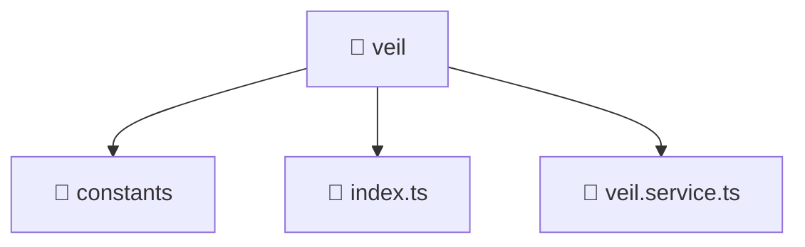

<!--
Mavluda Beauty - Luxury Professional Documentation
Generated for 100% Architectural Transparency
-->
[Home](../../../../README.md) > [frontend](../../../README.md) > [src](../../README.md) > [entities](../README.md) > [veil](./README.md)

# 👰 VEIL Directory

> **FSD Layer:** Entities

## 🎯 PURPOSE
Manages business entities, models, and core state related to specific domain objects.

## 🏗️ ARCHITECTURE


## 📄 FILE REGISTRY
| File Name | Type | Responsibility | Key Aliases Used |
|---|---|---|---|
| `index.ts` | TypeScript | Core logic implementation. | - |
| `veil.service.ts` | TypeScript | Business logic and service orchestration. | @angular, @core, @features, @shared |


## 🔗 DEPENDENCIES
- `@angular/common/http`
- `@angular/core`
- `@core/constants`
- `@features/veil`
- `@shared/lib`
- `rxjs`

## 🛠️ USAGE
```typescript
// Example placeholder for interacting with veil
// Consult the individual files in the registry for specific APIs.
```
