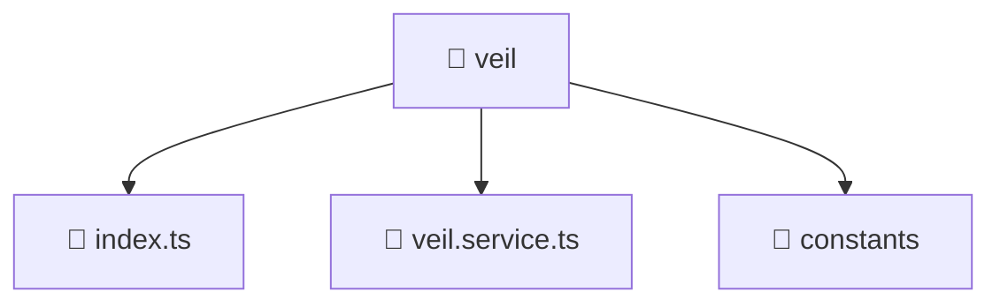

### 🧭 Breadcrumbs
[Root](/) > [frontend](/frontend) > [src](/frontend/src) > [entities](/frontend/src/entities) > [veil](/frontend/src/entities/veil)

# 📁 Veil Directory
**Architecture Layer:** Entity Layer

## 🎯 Purpose
Provides luxury professional architectural implementation for the veil module within the Mavluda Beauty ecosystem. Ensure robust functionality and elegant integration with the broader architecture.

## 🏗️ ARCHITECTURE


## 📄 FILE REGISTRY
| File Name | Type | Responsibility | Key Aliases Used |
|---|---|---|---|
| `index.ts` | TypeScript | Provides core logic and orchestration for index.ts. | N/A |
| `veil.service.ts` | TypeScript | Encapsulates business logic and data access for veil.service.ts. | @core/constants, @angular/core, @features/veil, @shared/lib, @angular/common/http |

## 🔗 DEPENDENCIES
- `@angular/common/http`
- `@angular/core`
- `@core/constants`
- `@features/veil`
- `@shared/lib`

## 🛠️ USAGE
```typescript
// Example architectural integration for veil
// Utilize the exported members according to Mavluda Beauty's standard conventions.
```

---
*Maintained by Mavluda Beauty - Architecture & Engineering*

---
*Maintained by Mavluda Beauty - Architecture & Engineering*