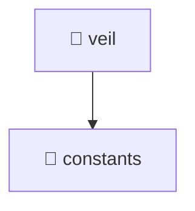

# 📁 veil

[Root](/.) > [frontend](/frontend) > [src](/frontend/src) > [entities](/frontend/src/entities) > [veil](/frontend/src/entities/veil)

## 🎯 Purpose
Delivering luxury-tier architectural components and high-performance logic for the **veil** domain. This directory is a crucial part of the Mavluda Beauty full-stack ecosystem, ensuring seamless scalability, robust performance, and an elite digital experience.
> **FSD Layer:** Entities - Adhering to strict Feature Sliced Design architectural constraints.

## 🏗️ Architecture


## 📄 File Registry
| File Name | Type | Responsibility | Key Aliases Used |
|---|---|---|---|
| `index.ts` | File | Core logic and utilities for this domain. | N/A |
| `veil.service.ts` | Service | Business logic and state management. | @angular, @core, @features, @shared |


## 🔗 Dependencies
- `./veil.service`
- `./constants/veil.constants`
- `@angular/common/http`
- `@angular/core`
- `@core/constants`
- `@features/veil`
- `@shared/lib`
- `rxjs`

## 🛠️ Usage
```typescript
// Example usage within the Mavluda Beauty ecosystem
import { relevantMember } from './index';

// Integrate into the application architecture
relevantMember.execute();
```
