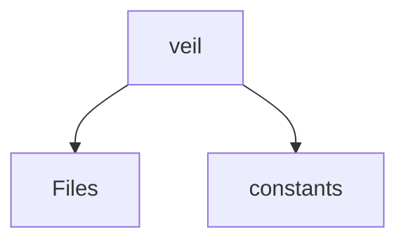

# 📁 Veil Directory

[frontend](/frontend) > [src](/frontend/src) > [entities](/frontend/src/entities) > [veil](/frontend/src/entities/veil)

## 🎯 Purpose
A high-level module handling `veil` logic within the Mavluda Beauty ecosystem. This directory adheres to our "Luxury Professional" architectural standards.

**FSD Layer:** Entities


## 🏗️ Architecture



## 📄 File Registry
| File Name | Type | Responsibility | Key Aliases Used |
|-----------|------|----------------|------------------|
| `index.ts` | TypeScript | Provides localized typescript definitions. | None |
| `veil.service.ts` | Service | Executes core business logic and use cases. | @angular/core, @core/constants, @angular/common/http, @shared/lib, @features/veil |

## 🔗 Dependencies
- `@angular/common/http`
- `@angular/core`
- `@core/constants`
- `@features/veil`
- `@shared/lib`

## 🛠️ Usage
```typescript
// Architectural overview snippet
import { InternalLogic } from './internal-file';
// Ensure adherence to Hexagonal / FSD principles
```
