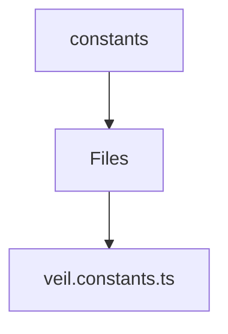

# 🏷️ Constants Directory

> *Elegance, Precision, and Luxury Professionalism — The Mavluda Beauty Standard.*

## 🧭 Breadcrumb Navigation
[frontend](/frontend) ➔ [src](/frontend/src) ➔ [entities](/frontend/src/entities) ➔ [veil](/frontend/src/entities/veil) ➔ [constants](/frontend/src/entities/veil/constants)

## 🎯 Purpose
This directory encapsulates the essential architecture and logic for the **Constants** domain within the Mavluda Beauty ecosystem. It serves as a foundational component ensuring robust, scalable, and elegant operations.

**Feature Sliced Design (FSD) Layer:** `Entity`

## 🏗️ Architecture


## 📄 File Registry
| File Name | Type | Responsibility | Key Aliases Used |
|---|---|---|---|
| `veil.constants.ts` | TypeScript | Exports: VEIL_CATEGORIES, VEIL_SILHOUETTES, VEIL_NECKLINES... | None |

## 🔗 Dependencies
No external or cross-module dependencies detected.

## 🛠️ Usage
```typescript
// To utilize the luxurious capabilities of this module:
import { VEIL_CATEGORIES } from './path/to/veil_categories';

// Ensure properly typed interactions per Mavluda Beauty standards
```
