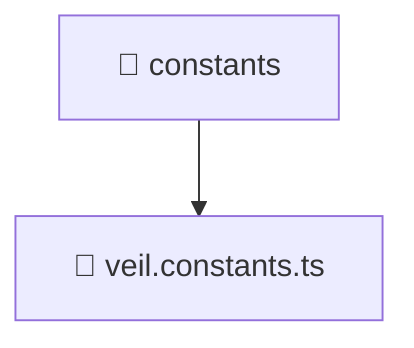

# 📁 constants

[Root](/../../../../../README.md) / [frontend](../../../../README.md) / [src](../../../README.md) / [entities](../../README.md) / [veil](../README.md) / [constants](./README.md)

## 🎯 Purpose
Delivering luxury-tier architectural components and high-performance logic for the **constants** domain. This directory is a crucial part of the Mavluda Beauty full-stack ecosystem, ensuring seamless scalability, robust performance, and an elite digital experience.

**FSD Layer:** Entities

## 🏗️ Architecture


## 📄 File Registry
| File Name | Type | Responsibility | Key Aliases Used |
|---|---|---|---|
| `veil.constants.ts` | TypeScript | Provides core logic and orchestration for veil.constants.ts. | N/A |


## 🔗 Dependencies
- No external dependencies.

## 🛠️ Usage
```typescript
// Example usage within the Mavluda Beauty ecosystem
import { relevantMember } from './veil.constants';

// Integrate into the application architecture
relevantMember.execute();
```
