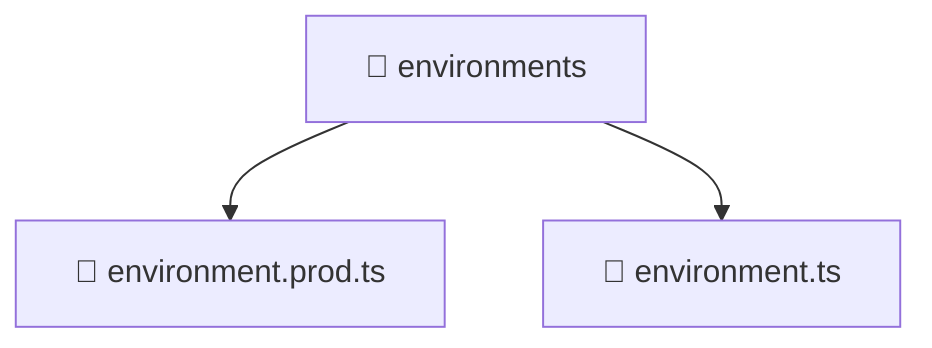

# 📁 environments

[Root](/.) > [frontend](/frontend) > [src](/frontend/src) > [environments](/frontend/src/environments)

## 🎯 Purpose
Delivering luxury-tier architectural components and high-performance logic for the **environments** domain. This directory is a crucial part of the Mavluda Beauty full-stack ecosystem, ensuring seamless scalability, robust performance, and an elite digital experience.

## 🏗️ Architecture


## 📄 File Registry
| File Name | Type | Responsibility | Key Aliases Used |
|---|---|---|---|
| `environment.prod.ts` | TypeScript | Provides core logic and orchestration for environment.prod.ts. | N/A |
| `environment.ts` | TypeScript | Provides core logic and orchestration for environment.ts. | N/A |

## 🔗 Dependencies
- No external dependencies.

## 🛠️ Usage
```typescript
// Example usage within the Mavluda Beauty ecosystem
import { relevantMember } from './core';

// Integrate into the application architecture
relevantMember.execute();
```
