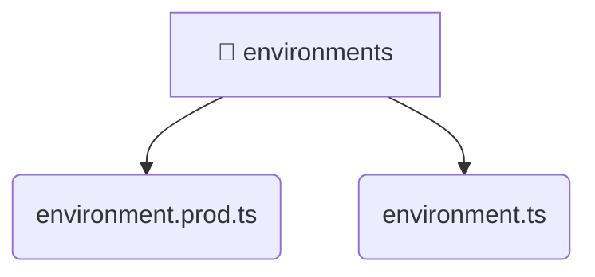

# [frontend](/frontend) / [src](/frontend/src) / [environments](/frontend/src/environments)

## 🏷️ 📁 Environments

### 🎯 PURPOSE
The `environments` directory forms a critical foundation within the Mavluda Beauty ecosystem, meticulously orchestrating the environments logic to ensure a seamless and premium experience. Integrated within our cutting-edge Angular frontend architecture, it crafts an elegant, highly-responsive user interface reflecting our luxury brand standards.

### 🏗️ ARCHITECTURE


### 📄 FILE REGISTRY
| File Name | Type | Responsibility | Key Aliases Used |
|---|---|---|---|
| `environment.prod.ts` | `ts` | Encapsulates premium logic and definitions for `environment.prod.ts`. | None |
| `environment.ts` | `ts` | Encapsulates premium logic and definitions for `environment.ts`. | None |


### 🔗 DEPENDENCIES
- *Self-contained premium module.*

### 🛠️ USAGE
```typescript
// Seamlessly integrate environments into your refined workflows:
import { /* exported members */ } from '@path/to/environments';
```
