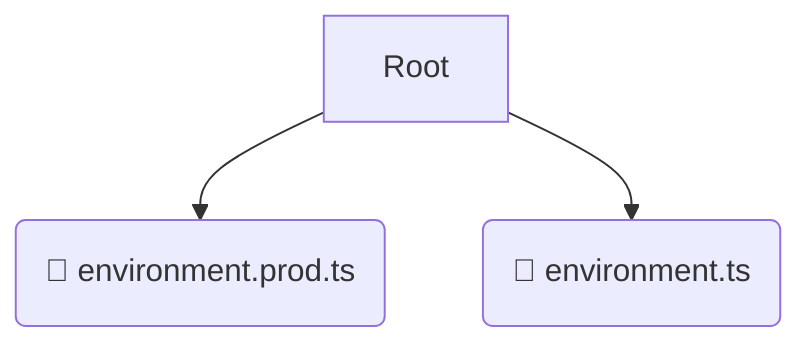

# 📂 environments

*Breadcrumbs:* [frontend](/frontend) / [src](/frontend/src) / [environments](/frontend/src/environments)

## 🎯 PURPOSE
This directory `environments` is an integral part of the Mavluda Beauty ecosystem. It contributes to the Angular zoneless, signal-based frontend.
This directory is meticulously maintained to uphold the 'Luxury Professional' standards of the Mavluda Beauty brand.

## 🏗️ ARCHITECTURE


## 📄 FILE REGISTRY
| File Name | Type | Responsibility | Key Aliases Used |
|---|---|---|---|
| `environment.prod.ts` | `ts` | Core functionality | `None` |
| `environment.ts` | `ts` | Core functionality | `None` |

## 🔗 DEPENDENCIES
- No significant internal/external dependencies found.

## 🛠️ USAGE
```typescript
// Example placeholder for interacting with the environments module
import { example } from './environment.prod.ts';
```
