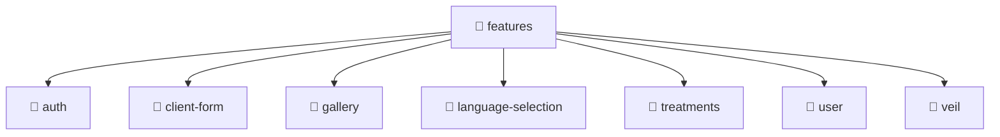

# 🚀 features

[Root](/../../../README.md) / [frontend](../../README.md) / [src](../README.md) / [features](./README.md)

## 🎯 Purpose
Delivering luxury-tier architectural components and high-performance logic for the **features** domain. This directory is a crucial part of the Mavluda Beauty full-stack ecosystem, ensuring seamless scalability, robust performance, and an elite digital experience.

**FSD Layer:** Features

## 🏗️ Architecture


## 📄 File Registry
| File Name | Type | Responsibility | Key Aliases Used |
|---|---|---|---|
| N/A | N/A | No files in this directory. | N/A |


## 🔗 Dependencies
- No external dependencies.

## 🛠️ Usage
```typescript
// Example usage within the Mavluda Beauty ecosystem
import { relevantMember } from './core';

// Integrate into the application architecture
relevantMember.execute();
```
