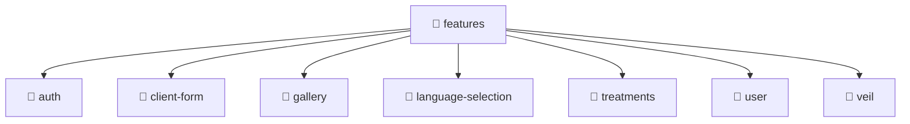

# 📁 Features Directory

[Root](/.) / [frontend](/frontend) / [src](/frontend/src) / [features](/frontend/src/features)

## 🎯 Purpose
Delivering luxury-tier architectural components and high-performance logic for the **features** domain. This directory is a crucial part of the Mavluda Beauty full-stack ecosystem, ensuring seamless scalability, robust performance, and an elite digital experience.
**FSD Layer:** Features


## 🏗️ Architecture


## 📄 File Registry
| File Name | Type | Responsibility | Key Aliases Used |
|---|---|---|---|
| `auth` | Directory | Contains architectural sub-modules and layer logic for auth. | N/A |
| `client-form` | Directory | Contains architectural sub-modules and layer logic for client-form. | N/A |
| `gallery` | Directory | Contains architectural sub-modules and layer logic for gallery. | N/A |
| `language-selection` | Directory | Contains architectural sub-modules and layer logic for language-selection. | N/A |
| `treatments` | Directory | Contains architectural sub-modules and layer logic for treatments. | N/A |
| `user` | Directory | Contains architectural sub-modules and layer logic for user. | N/A |
| `veil` | Directory | Contains architectural sub-modules and layer logic for veil. | N/A |

## 🔗 Dependencies
- Relies on internal Mavluda Beauty architecture and designated FSD layers.
- See 'Key Aliases Used' in the File Registry for explicit cross-domain references.

## 🛠️ Usage
```typescript
// Example usage within the Mavluda Beauty ecosystem
import { relevantMember } from './core';

// Integrate into the application architecture
relevantMember.execute();
```
