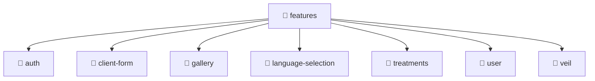

# 📁 features

[Root](/.) > [frontend](/frontend) > [src](/frontend/src) > [features](/frontend/src/features)

## 🎯 Purpose
Delivering luxury-tier architectural components and high-performance logic for the **features** domain. This directory is a crucial part of the Mavluda Beauty full-stack ecosystem, ensuring seamless scalability, robust performance, and an elite digital experience.

## 🏗️ Architecture


## 📄 File Registry
*(No immediate files in this directory)*

## 🔗 Dependencies
*(No specific external or cross-module dependencies detected)*

## 🛠️ Usage
```typescript
// Example usage within the Mavluda Beauty ecosystem
import { relevantMember } from './features';

// Integrate into the application architecture
relevantMember.execute();
```
