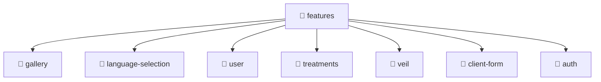

[🏠 Home](../../../README.md) > [frontend](../../README.md) > [src](../README.md) > [features](./README.md)

# ⭐ features

**FSD Layer:** `Features`

### 🎯 PURPOSE
Welcome to the exquisite **features** module of the Mavluda Beauty ecosystem. This directory handles specific domain assets and logic. It is designed adhering to our 'Luxury Professional' standards.

### 🏗️ ARCHITECTURE


### 📄 FILE REGISTRY
| File Name | Type | Responsibility | Key Aliases Used |
|---|---|---|---|
| _No files_ | - | - | - |

### 🔗 DEPENDENCIES
No notable dependencies detected.

### 🛠️ USAGE
```typescript
// Example interaction or integration snippet
// Import members from features based on module boundaries
```
