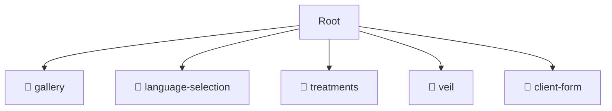

# ⭐ features

*Breadcrumbs:* [frontend](/frontend) / [src](/frontend/src) / [features](/frontend/src/features)

## 🎯 PURPOSE
This directory `features` is an integral part of the Mavluda Beauty ecosystem. (FSD Layer: Features) It implements business value features, bringing together entities and shared elements.
This directory is meticulously maintained to uphold the 'Luxury Professional' standards of the Mavluda Beauty brand.

## 🏗️ ARCHITECTURE


## 📄 FILE REGISTRY
| File Name | Type | Responsibility | Key Aliases Used |
|---|---|---|---|

## 🔗 DEPENDENCIES
- No significant internal/external dependencies found.

## 🛠️ USAGE
```typescript
// Example placeholder for interacting with the features module
import { example } from './example';
```
