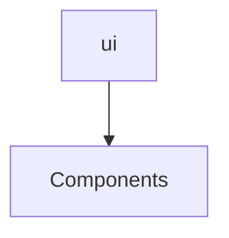

# 🖼️ Ui Directory

[frontend](/frontend) > [src](/frontend/src) > [features](/frontend/src/features) > [auth](/frontend/src/features/auth) > [ui](/frontend/src/features/auth/ui)

## 🎯 Purpose
A high-level module handling `ui` logic within the Mavluda Beauty ecosystem. This directory adheres to our "Luxury Professional" architectural standards.

**FSD Layer:** Features


## 🏗️ Architecture



## 📄 File Registry
| File Name | Type | Responsibility | Key Aliases Used |
|-----------|------|----------------|------------------|

## 🔗 Dependencies
- No major internal/external path aliases detected.

## 🛠️ Usage
```typescript
// Architectural overview snippet
import { InternalLogic } from './internal-file';
// Ensure adherence to Hexagonal / FSD principles
```
