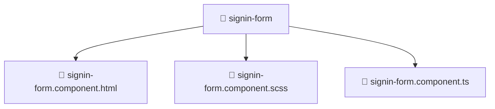

### 🧭 Breadcrumbs
[Root](/) > [frontend](/frontend) > [src](/frontend/src) > [features](/frontend/src/features) > [auth](/frontend/src/features/auth) > [ui](/frontend/src/features/auth/ui) > [signin-form](/frontend/src/features/auth/ui/signin-form)

# 📁 Signin-form Directory
**Architecture Layer:** Feature Layer

## 🎯 Purpose
Provides luxury professional architectural implementation for the signin-form module within the Mavluda Beauty ecosystem. Ensure robust functionality and elegant integration with the broader architecture.

## 🏗️ ARCHITECTURE


## 📄 FILE REGISTRY
| File Name | Type | Responsibility | Key Aliases Used |
|---|---|---|---|
| `signin-form.component.html` | HTML Template | Structural markup and UI layout. | N/A |
| `signin-form.component.scss` | Stylesheet | Visual styling and design system definitions. | N/A |
| `signin-form.component.ts` | TypeScript | Contains core business logic. | @angular/core, @angular/forms/signals, @shared/services, @features/auth/model/auth.model |

## 🔗 DEPENDENCIES
- `@angular/core`
- `@angular/forms/signals`
- `@features/auth/model/auth.model`
- `@shared/services`

## 🛠️ USAGE
```typescript
// Example architectural integration for signin-form
// Utilize the exported members according to Mavluda Beauty's standard conventions.
```

---
*Maintained by Mavluda Beauty - Architecture & Engineering*

---
*Maintained by Mavluda Beauty - Architecture & Engineering*