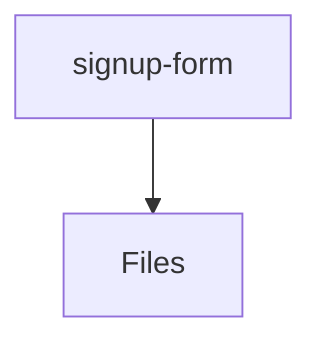

# 📁 Signup-Form Directory

[frontend](/frontend) > [src](/frontend/src) > [features](/frontend/src/features) > [auth](/frontend/src/features/auth) > [ui](/frontend/src/features/auth/ui) > [signup-form](/frontend/src/features/auth/ui/signup-form)

## 🎯 Purpose
A high-level module handling `signup-form` logic within the Mavluda Beauty ecosystem. This directory adheres to our "Luxury Professional" architectural standards.

**FSD Layer:** Features


## 🏗️ Architecture



## 📄 File Registry
| File Name | Type | Responsibility | Key Aliases Used |
|-----------|------|----------------|------------------|
| `signup-form.component.html` | Template | Angular UI standalone component logic. | None |
| `signup-form.component.scss` | Style | Angular UI standalone component logic. | None |
| `signup-form.component.ts` | Component | Angular UI standalone component logic. | @angular/forms/signals, @angular/core, @features/auth/model/auth.model |

## 🔗 Dependencies
- `@angular/core`
- `@angular/forms/signals`
- `@features/auth/model/auth.model`

## 🛠️ Usage
```typescript
// Architectural overview snippet
import { InternalLogic } from './internal-file';
// Ensure adherence to Hexagonal / FSD principles
```
