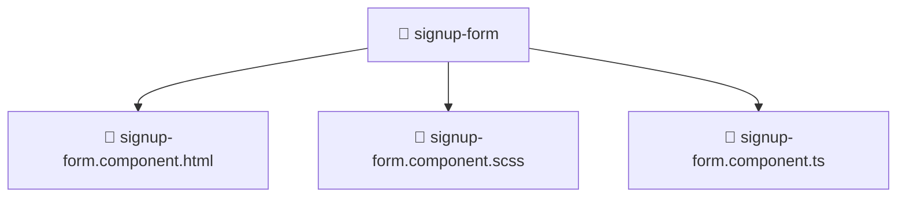

# 📁 signup-form

[Root](/.) > [frontend](/frontend) > [src](/frontend/src) > [features](/frontend/src/features) > [auth](/frontend/src/features/auth) > [ui](/frontend/src/features/auth/ui) > [signup-form](/frontend/src/features/auth/ui/signup-form)

**FSD Layer:** Features

## 🎯 Purpose
Delivering luxury-tier architectural components and high-performance logic for the **signup-form** domain. This directory is a crucial part of the Mavluda Beauty full-stack ecosystem, ensuring seamless scalability, robust performance, and an elite digital experience.

## 🏗️ Architecture


## 📄 File Registry
| File Name | Type | Responsibility | Key Aliases Used |
|---|---|---|---|
| `signup-form.component.html` | HTML Template | Structural layout for signup-form | N/A |
| `signup-form.component.scss` | Stylesheet | Luxury styling and layout for signup-form | N/A |
| `signup-form.component.ts` | File | Provides core domain logic | N/A |

## 🔗 Dependencies
- No explicit cross-layer aliases detected.

## 🛠️ Usage
```typescript
// Example usage within the Mavluda Beauty ecosystem
import { relevantMember } from './signup-form';

// Integrate into the application architecture
relevantMember.execute();
```
