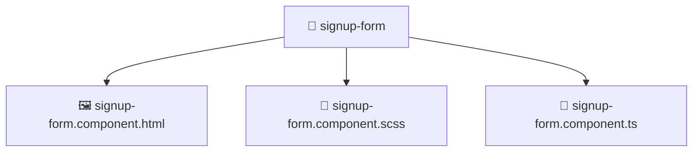

# 📁 signup-form

[Root](/../../../../../../README.md) / [frontend](../../../../../README.md) / [src](../../../../README.md) / [features](../../../README.md) / [auth](../../README.md) / [ui](../README.md) / [signup-form](./README.md)

## 🎯 Purpose
Delivering luxury-tier architectural components and high-performance logic for the **signup-form** domain. This directory is a crucial part of the Mavluda Beauty full-stack ecosystem, ensuring seamless scalability, robust performance, and an elite digital experience.

**FSD Layer:** Features

## 🏗️ Architecture


## 📄 File Registry
| File Name | Type | Responsibility | Key Aliases Used |
|---|---|---|---|
| `signup-form.component.html` | Template | Provides core logic and orchestration for signup-form.component.html. | N/A |
| `signup-form.component.scss` | Stylesheet | Provides core logic and orchestration for signup-form.component.scss. | N/A |
| `signup-form.component.ts` | Component | Provides core logic and orchestration for signup-form.component.ts. | @angular, @features |


## 🔗 Dependencies
**Internal / Aliases:**
- `@angular/core`
- `@angular/forms/signals`
- `@features/auth/model/auth.model`


## 🛠️ Usage
```typescript
// Example usage within the Mavluda Beauty ecosystem
import { relevantMember } from './signup-form.component';

// Integrate into the application architecture
relevantMember.execute();
```
